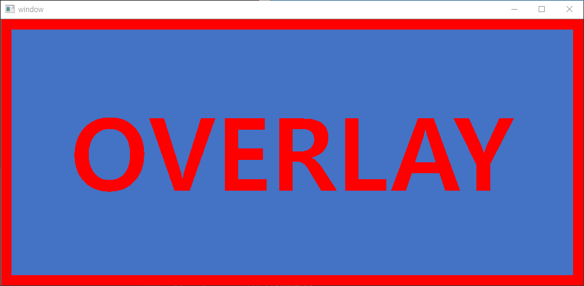

# C#-OpenCV Image Composition (Alpha Blending)

This code is about how to do alpha blending of two images - underlying and overlay images - to compose them.

## Development Environment
* OS: Windows 7/10 x64
* Language: C#
* Prerequisite Library: [OpenCvSharp3-AnyCPU](https://www.nuget.org/packages/OpenCvSharp3-AnyCPU/)
* IDE: Microsoft Visual Studio 2015

## Usage
Just build and run it in Visual Studio.

## Example
* Underlying Image
  
</img>
  
* Overlay Image
  
</img>
  
* Result(Blended) Image
  
</img>
